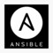

# Welcome to my profile 👋
### Who I am?
My name is Epiphane EGAH. I have a master's degree in econometry and statistics. During my studies, I have to perform a research project. I choose to work on word embedding. Since then, I have fallen in love with natural language processing.

Currently, I am learning :
- How to build artificial intelligence project with CRISP-DM
- Natural language processing 
- Computer vision 
- Machine learning operation (MLOps)

### IT Stacks
        
 
        

 ### IDEs
  
 
 ### Stacks I want to learn
      
 
  
 <!---           -->

 ### Networking
  </a>
    

 ### Statistics
 
 

### Education
 
 
 
 
 
 
 

 <!--### STACKS I WANT TO LEARN--
 
 
